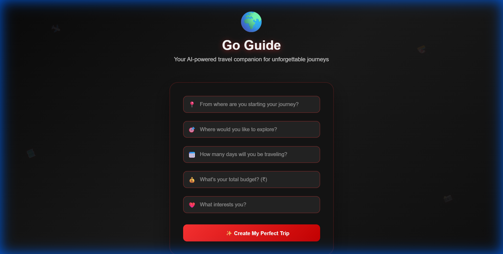

# 🌍 Go Guide - AI Travel Planner

**Go Guide** is a modern, AI-powered web application that helps you plan personalized travel itineraries in seconds. Powered by the **Llama-3.3-70B** model via the Together API, it generates detailed day-by-day plans tailored to your budget, interests, and schedule.


## 🚀 Features

- **Personalized Itineraries**: Generates comprehensive travel plans based on destination, duration, budget, and interests.
- **Smart AI Integration**: Uses state-of-the-art LLMs to provide local insights, cuisine recommendations, and cultural tips.
- **Secure Configuration**: Uses a local `config.js` file to securely manage your API key. No keys are exposed in the UI or code.
- **Beautiful UI**: A responsive, dark-themed interface with smooth animations and glassmorphism effects.
- **Markdown Rendering**: Itineraries are formatted beautifully with bold text, lists, and headers.
- **Export Options**: Easily **Copy** your itinerary to the clipboard or **Print/Save as PDF** (optimized for print).

## 🛠️ Tech Stack

- **Frontend**: HTML5, CSS3 (Custom Variables, Animations), JavaScript (ES6+)
- **AI Model**: Llama-3.3-70B-Instruct-Turbo via [Together AI](https://www.together.ai/)
- **Libraries**: [Marked.js](https://marked.js.org/) for Markdown rendering, [FontAwesome](https://fontawesome.com/) for icons.

## ⚙️ Setup & Usage

1.  **Clone the Repository**
    ```bash
    git clone https://github.com/sn9729/go-guide-ai-tourist-guide.git
    cd go-guide-ai-tourist-guide
    ```

2.  **Get a Together API Key**
    - Sign up at [Together AI](https://api.together.xyz/).
    - Create a new API key in your dashboard.

3.  **Configure API Key**
    - Rename `config.example.js` to `config.js`:
      ```bash
      mv config.example.js config.js
      # OR on Windows
      rename config.example.js config.js
      ```
    - Open `config.js` and paste your API key:
      ```javascript
      const CONFIG = {
        API_KEY: "YOUR_ACTUAL_API_KEY_HERE"
      };
      ```
    - *Note: `config.js` is ignored by Git to keep your key secure.*

4.  **Run the App**
    - Simply open `index.html` in your web browser.
    - OR use a local server (recommended for best performance):
      ```bash
      npx serve .
      ```

5.  **Plan Your Trip!**
    - Enter your trip details (Source, Destination, Days, Budget, Interests).
    - Click **Create My Perfect Trip**.
    - Watch the AI craft your itinerary! ✈️

## 📸 Screenshots



## 📄 License

This project is open-source and available under the [MIT License](LICENSE).
